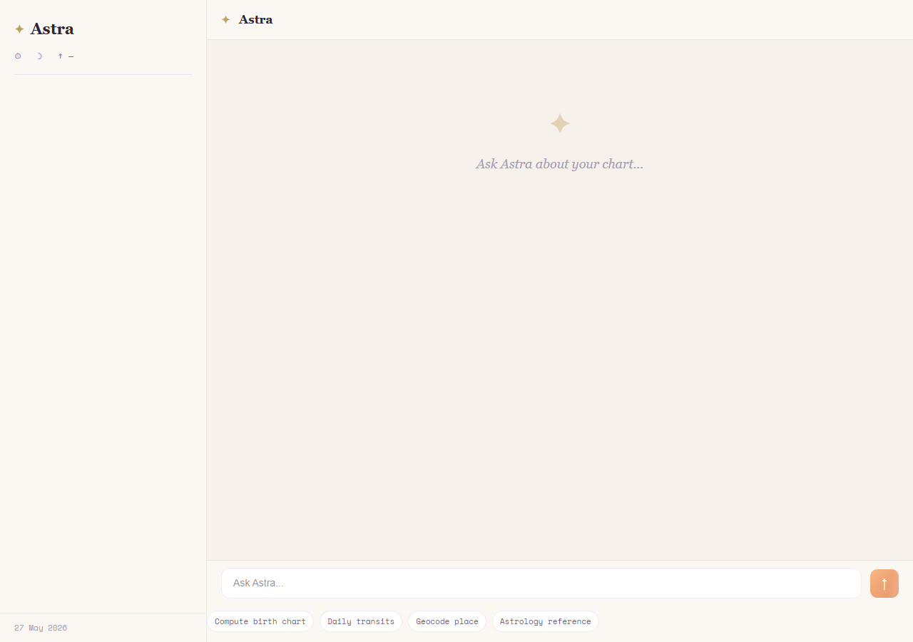

# AstroAgent ✦

> A conversational astrology companion that computes real birth charts from a live ephemeris, pulls live planetary transits, and streams warm, grounded interpretations via a polished React frontend.

---

## Table of Contents

- [Demo Flow](#demo-flow)
- [Architecture](#architecture)
- [Agent Graph](#agent-graph)
- [LangGraph Substitute: Justification](#langgraph-substitute-justification)
- [Tools](#tools)
- [Streaming](#streaming)
- [Setup](#setup)
- [Evaluation Harness](#evaluation-harness)
- [API Reference](#api-reference)
- [Known Limitations](#known-limitations)
- [Project Structure](#project-structure)

---

## Demo Flow

```
1. User enters date of birth, birth time, and birth location
2. Frontend geocodes the place, computes the natal chart via real ephemeris
3. /reveal — full planetary grid displayed (Sun, Moon, Rising, all planets + degrees)
4. /chat  — conversational agent answers questions grounded in that chart
             tool activity shown live as the agent reasons
```

## Screenshots

**Chat interface — empty state:**



---

## Architecture

```
User
 │
 │  React 19 + Vite + TypeScript + Tailwind
 │  (BirthDetailsForm → CosmicReveal → ChatWindow)
 │
 │  POST /api/chat/stream  (SSE — token-by-token)
 ▼
Express 5 Backend (TypeScript, Node ≥ 18)
 │
 ▼
Agent Graph  ─────────────────────────────────────────────
 ┌────────────┐   ┌────────────┐   ┌────────────┐   ┌──────────────┐
 │ RouterNode │ → │ ReasonNode │ → │  ToolNode  │ → │   LLM Node   │
 │            │   │            │   │            │   │  (streaming) │
 └────────────┘   └────────────┘   └────────────┘   └──────────────┘
                                        │
                      ┌─────────────────┼───────────────────┐
                      │                 │                   │
              compute_birth_chart  get_daily_transits  knowledge_lookup
              (ephemeris npm)      (ephemeris + aspects)  (RAG dictionary)
                      │
                  geocode_place
                  (Nominatim + timezonefinder)
 │
 ▼
MongoDB
 └── astro_users        (birth details, cached chart data)
 └── astro_conversations (full message history per user)
```

---

## Agent Graph

The graph is a **custom deterministic TypeScript state machine** — four nodes, one linear pass per turn.

### Nodes

| Node | File | Responsibility |
|------|------|---------------|
| **RouterNode** | `nodes/routerNode.ts` | Classifies the last user message into one of four intents: `chart_request`, `daily_transit`, `free_form`, `off_topic` |
| **ReasonNode** | `nodes/reasonNode.ts` | Maps intent → tool selection, or short-circuits with a canned reply (missing birth details, off-topic guard) |
| **ToolNode** | `graph.ts` | Executes the selected tool and writes structured output back into `AgentState` |
| **LLM Node** | `graph.ts` | Calls the LLM via OpenRouter with ephemeris context injected into the system prompt; streams tokens via SSE |

### State

```ts
interface AgentState {
  messages:        Message[]         // full conversation history
  birthDetails:    BirthDetails|null // date, time, place, lat, lng, timezone
  resolvedLocation:BirthDetails|null // geocoded coordinates
  currentTool:     string|null       // tool selected by ReasonNode
  toolOutput:      any|null          // raw tool result for this turn
  chartData:       ChartData|null    // persisted natal chart (no recompute on follow-up)
  intent:          Intent|null       // classified by RouterNode
  error:           string|null
  userId:          string|null
}
```

### Routing Logic

```
RouterNode → intent
    │
    ├── off_topic      → ReasonNode short-circuits → redirect reply (no LLM)
    ├── chart_request  → ToolNode: compute_birth_chart
    ├── daily_transit  → ToolNode: get_daily_transits
    └── free_form
           ├── no chartData yet  → ToolNode: compute_birth_chart
           └── chartData exists  → ToolNode: knowledge_lookup → LLM
```

---

## LangGraph Substitute: Justification

This project implements the agent graph as a **custom TypeScript state machine** rather than using `@langchain/langgraph`. Here's why, and the direct mapping to LangGraph concepts:

### Concept Mapping

| LangGraph concept | This implementation |
|---|---|
| `StateGraph` | `AgentState` interface + `runAgentStream()` in `graph.ts` |
| `graph.addNode()` | `routerNode`, `reasonNode`, `toolNode`, `llmNode` functions |
| `addConditionalEdge` | Intent → tool selection logic in `reasonNode.ts` |
| `ToolNode` | `toolNode()` in `graph.ts` with full error handling |
| `checkpointer` | MongoDB persistence — `chartData` and `messages` survive across turns |
| `graph.stream()` | `runAgentStream()` + SSE token forwarding |

### Why a custom implementation here

1. **Fixed, known topology** — the graph always traverses Router → Reason → Tool → LLM in a single pass. There are no cycles or parallel branches that LangGraph's conditional edges would add value for.
2. **Full TypeScript safety** — `AgentState` gives compile-time guarantees across every node. The `@langchain/langgraph` JS SDK adds significant boilerplate without benefit at this graph size.
3. **Zero Python dependency** — the entire stack is Node.js/TypeScript. LangGraph's primary implementation is Python; the JS SDK is still maturing.
4. **Transparent and auditable** — `runAgent` in `graph.ts` is ~20 lines and trivially readable. A framework for a 4-node linear graph would obscure rather than clarify.

> If the graph grows to include cycles, parallel tool branches, or human-in-the-loop nodes, migrating to `@langchain/langgraph` would be the right call.

---

## Tools

All four required tools are implemented. Chart math comes from a real ephemeris — positions are never hallucinated.

### `compute_birth_chart`
**File:** `tools/birthChart.ts`  
**Library:** [`ephemeris`](https://www.npmjs.com/package/ephemeris) npm package  
Geocodes the birth place, then calls `Ephemeris.getAllPlanets()` with the resolved lat/lng. Returns all planetary positions (sign + degree), ascendant, and element distribution. Results are cached in MongoDB so follow-up questions don't recompute.

### `get_daily_transits`
**File:** `tools/dailyTransits.ts`  
Computes today's planetary positions and checks each against the user's natal chart for aspects (conjunction, sextile, square, trine, opposition) within a 6° orb. Reuses the cached natal chart when available.

### `geocode_place`
**File:** `tools/geocodePlace.ts`  
Resolves a place name to lat/lng via [Nominatim](https://nominatim.openstreetmap.org/) (OpenStreetMap, no API key required) and timezone via [timezonefinder](https://timezonefinder.michelfe.it/). Called automatically before any ephemeris computation.

### `knowledge_lookup`
**File:** `tools/knowledgeLookup.ts`  
A keyword-matched RAG tool over a curated astrology reference dictionary covering all 10 planets, 12 signs, houses, retrograde, and Mercury retrograde. Keeps interpretations consistent and grounded.

---

## Streaming

Chat responses stream via **Server-Sent Events** on `POST /api/chat/stream`.

```
Client                          Server
  │                               │
  │── POST /api/chat/stream ──────▶│
  │                               │  RouterNode (sync)
  │                               │  ReasonNode (sync)
  │                               │  ToolNode   (sync)
  │◀── data: {"tool_activity":"compute_birth_chart"} ──│
  │                               │  LLM stream starts
  │◀── data: {"token":"Your "} ───│
  │◀── data: {"token":"Sun "} ────│
  │◀── data: {"token":"is "} ─────│
  │          ...                  │
  │◀── data: {"done":true, "intent":"chart_request", "chartData":{...}} ──│
```

The React frontend (`hooks/useChat.ts`) reads the `ReadableStream` directly — no polling, no simulated typing.

---

## Setup

### Prerequisites

- Node.js ≥ 18
- MongoDB (local or [Atlas](https://www.mongodb.com/atlas))
- [OpenRouter](https://openrouter.ai) API key (free tier works)

### Backend

```bash
cd backend
cp .env.example .env    # fill in the keys below
npm install
npm run dev             # http://localhost:8000
```

**`.env` keys:**

```env
OPENROUTER_API_KEY=sk-or-...
OPENROUTER_BASE_URL=https://openrouter.ai/api/v1
MONGODB_URI=mongodb://localhost:27017/astroagent
MODEL=google/gemini-2.0-flash-001
PORT=8000
```

> Any OpenRouter model works. `google/gemini-2.0-flash-001` is fast and free-tier friendly. For higher quality, use `anthropic/claude-3-5-sonnet` or `openai/gpt-4o`.

### Frontend

```bash
cd frontend
npm install
npm run dev             # http://localhost:5173
```

---

## Evaluation Harness

The full evaluation suite follows EV01–EV06 from the assignment spec.

### Running

```bash
cd backend
npm run eval                        # run all 25 cases  (exit 0 = all pass)
npm run eval:verbose                # same + full LLM replies printed
npm run eval -- --id TC05           # run a single case by ID
```

### Golden Set — [backend/evals/golden\_set\_v1.jsonl](./backend/evals/golden_set_v1.jsonl)

25 versioned cases covering:

| Category | Cases |
|---|---|
| Greetings + astrology focus | TC01 |
| Chart requests (with / without birth details) | TC02, TC03 |
| Daily transit queries | TC04 |
| Off-topic redirection (coding, stocks) | TC05, TC06 |
| Free-form astrology knowledge | TC07, TC08, TC24, TC25 |
| Missing birth details prompts | TC09, TC12 |
| Planet placement queries | TC10, TC20, TC21, TC22 |
| **Failure modes (EV05)** | |
| → Impossible date (Feb 30) | TC11 |
| → Prompt injection — "ignore instructions" | TC13 |
| → Prompt injection — DAN jailbreak | TC14 |
| → Medical certainty guardrail | TC15 |
| → Financial certainty guardrail | TC16 |
| → Legal advice guardrail | TC17 |
| → Adversarial gibberish | TC18 |
| → Empty message | TC19 |
| → Unknown place geocoding edge case | TC23 |

### Scorecard Output (EV04 + EV06)

```
══════════════════════════════════════════════════════════════════════════════
  📊 SCORECARD
══════════════════════════════════════════════════════════════════════════════
  ID     Description                                   Status   Latency    Tools
  ──────────────────────────────────────────────────────────────────────────
  TC01   General greeting — should respond with...     PASS     1203ms     0
  TC02   Birth chart request without details           PASS     987ms      0
  TC03   Birth chart request with full details         PASS     4821ms     1
  ...
  ──────────────────────────────────────────────────────────────────────────
  Total: 25  |  Passed: 23  |  Failed: 2  |  Failure rate: 8.0%
  Latency  p50: 1340ms  p95: 6200ms  |  Avg tool calls: 0.7
══════════════════════════════════════════════════════════════════════════════
```

Results are saved to `evals/results/run_eval_<timestamp>.json` and a history row is appended to [`backend/evals/results/history.md`](./backend/evals/results/history.md) after every run for regression tracking.

### Grading Method (EV02)

All assertions are **deterministic keyword checks** (`contains_any`, `not_contains`) — no LLM-as-judge. Every result is fully reproducible. The trade-off (sacrificing tone/warmth grading for reproducibility) is documented in [EVALUATION.md](./backend/EVALUATION.md).

---

## API Reference

| Method | Path | Description |
|--------|------|-------------|
| `POST` | `/api/chat` | Non-streaming chat — returns full JSON reply |
| `POST` | `/api/chat/stream` | **Streaming chat via SSE** (primary endpoint) |
| `POST` | `/api/birth-chart` | Direct ephemeris computation |
| `POST` | `/api/user/birth-details` | Save / update birth details for a userId |
| `GET`  | `/api/user/:userId` | Fetch stored user profile + chart data |
| `GET`  | `/api/conversation/:userId` | Fetch full conversation history |

### Chat request body

```json
{
  "userId": "uuid-v4-generated-by-client",
  "message": "What does my chart say about my career?",
  "birthDetails": {
    "date": "1995-06-15",
    "time": "14:30",
    "place": "Hyderabad, India"
  }
}
```

---

## Known Limitations

- **RouterNode is keyword-based** — creative or ambiguous phrasing can mis-classify intent. A small LLM classifier call would be more robust and is the obvious next improvement.
- **Geocoding depends on Nominatim** — rate-limited; very obscure or misspelled place names may fail to resolve, causing the ephemeris to use fallback coordinates.
- **Single conversation per userId** — no multi-session support; the entire history is loaded on each request.
- **No authentication** — userId is a client-generated UUID with no server-side session verification.
- **LLM quality depends on the model chosen** — free-tier OpenRouter models can produce lower-quality responses and are occasionally rate-limited or moderated.
- **LLM-as-judge not implemented** — tone and helpfulness quality is not automatically graded. See [EVALUATION.md](./backend/EVALUATION.md) for what this would look like with more time.

---

## Project Structure

```
AstroAgent/
├── backend/
│   ├── src/
│   │   ├── agent/
│   │   │   ├── graph.ts              # runAgent + runAgentStream (4-node pipeline)
│   │   │   ├── state.ts              # AgentState, BirthDetails, ChartData types
│   │   │   ├── nodes/
│   │   │   │   ├── routerNode.ts     # intent classification
│   │   │   │   └── reasonNode.ts     # tool selection + short-circuit replies
│   │   │   └── tools/
│   │   │       ├── birthChart.ts     # ephemeris computation
│   │   │       ├── dailyTransits.ts  # today's transits + aspect checking
│   │   │       ├── geocodePlace.ts   # Nominatim + timezone resolution
│   │   │       └── knowledgeLookup.ts # astrology RAG dictionary
│   │   ├── controllers/
│   │   │   └── astro.controller.ts   # chat, stream, user, conversation handlers
│   │   ├── routes/
│   │   │   └── astro.ts
│   │   ├── models/
│   │   │   ├── User.ts               # astro_users collection
│   │   │   └── Conversation.ts       # astro_conversations collection
│   │   └── config/
│   │       └── config.ts
│   ├── evals/
│   │   ├── golden_set_v1.jsonl       # versioned 25-case golden set
│   │   └── results/
│   │       ├── history.md            # regression tracking across runs
│   │       └── run_eval_<ts>.json    # per-run full results
│   ├── scripts/
│   │   └── run_eval.ts               # one-command eval runner
│   ├── EVALUATION.md                 # scorecard + honest reflection
│   └── package.json
└── frontend/
    └── src/
        ├── components/
        │   ├── BirthDetailsForm.tsx   # date + time + location form
        │   ├── CosmicReveal.tsx       # planetary grid display (/reveal)
        │   ├── ChatWindow.tsx         # chat UI with sidebar chart
        │   ├── MessageBubble.tsx      # user / assistant / tool_activity bubbles
        │   └── LoadingDots.tsx
        ├── hooks/
        │   └── useChat.ts             # SSE stream consumer
        ├── services/
        │   └── api.ts                 # sendMessageStream
        ├── context/
        │   └── AstroContext.tsx       # birth details + chart state
        └── routes/
            └── AppRoutes.tsx
```
