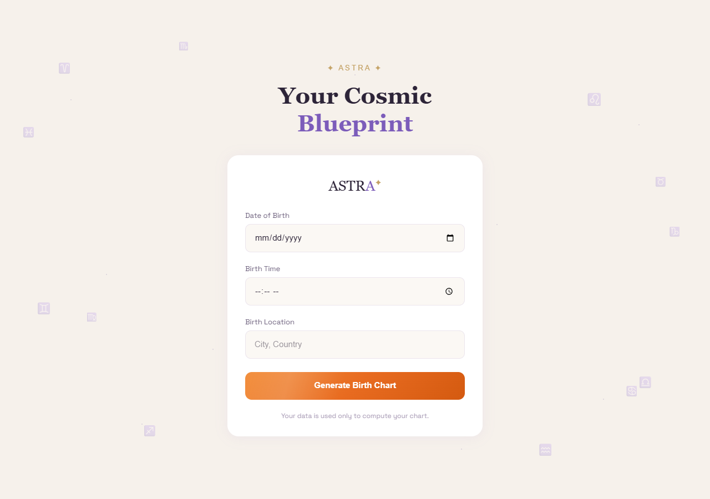
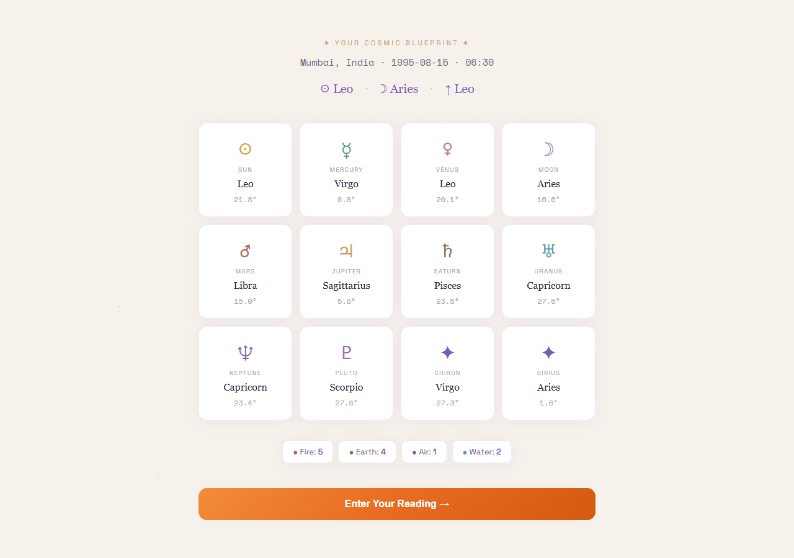
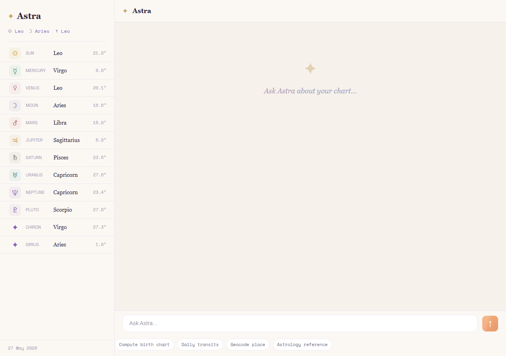
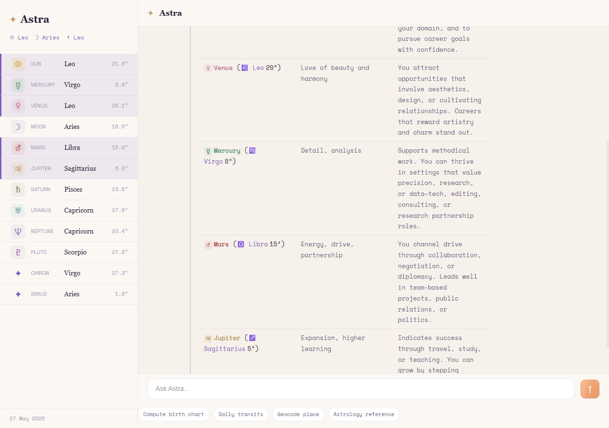
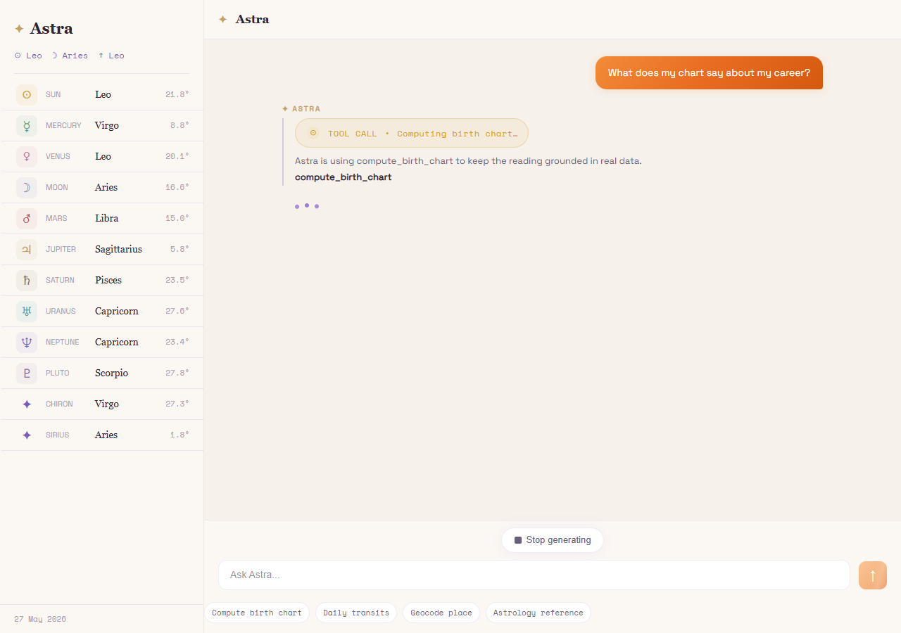
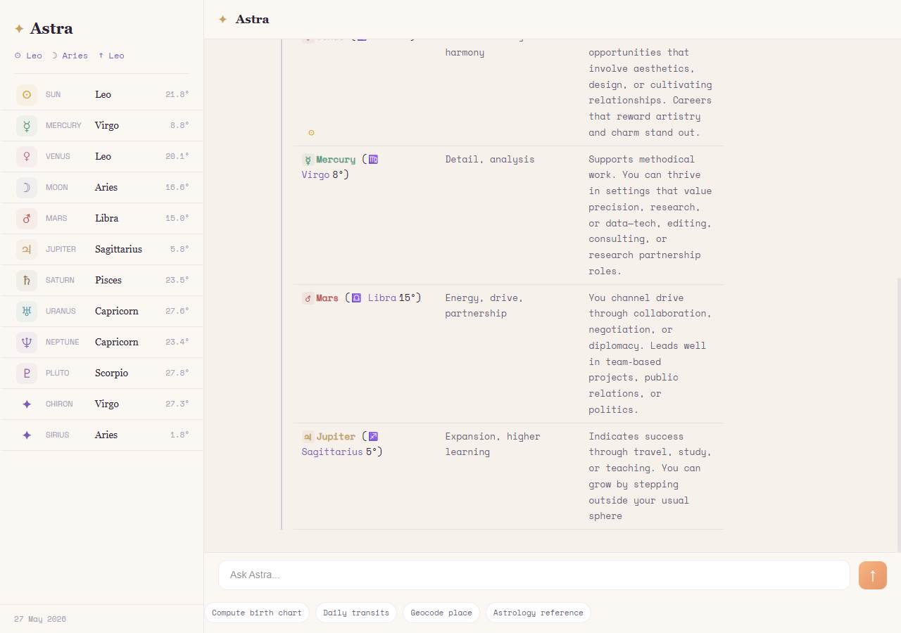

# ✦ Astra — Frontend

> The conversational face of AstroAgent. A calm, responsive React + TypeScript interface that collects birth details, computes the natal chart, and lets users stream a live conversation with an AI astrologer — with every tool call visible as it happens.

---

## Screenshots

### Birth Details Form


The entry point. Floating zodiac glyphs (♈ … ♓) orbit a centred card. Three validated fields — Date of Birth, Birth Time, and Birth Location — must all pass before the chart is computed. On submit the user is routed to the Cosmic Reveal.

---

### Cosmic Reveal


A full-screen interstitial that fires `computeBirthChart()` against the backend ephemeris and renders the result as an animated planet grid. Each card shows the planet's glyph, sign, and degree. An element breakdown bar (Fire / Earth / Air / Water counts) sits below. "Enter Your Reading →" routes to the chat.

---

### Chat Interface — Empty State


The main view. The left sidebar lists every planet with its sign and degree, live-highlighted whenever Astra mentions that planet in a response. The right panel is the message stream. Four quick-action chips at the bottom surface the four agent tools without the user needing to type a command.

---

### Chat Interface — Main View


The full chat UI showing sidebar, message stream, and input bar.

---

### Tool Call Badge


Tool activity appears as a pill (TOOL CALL) before the assistant reply streams.

---

### Streaming Chat Response


An example assistant reply streaming token-by-token with a stable table layout for natal data.

---

## Tech Stack

| Layer | Library / Version | Notes |
|---|---|---|
| Framework | React 19 + Vite 8 | ESM-native, instant HMR |
| Language | TypeScript 6 | Strict mode throughout |
| Routing | React Router DOM v7 | Three routes: `/` · `/reveal` · `/chat` |
| Styling | Tailwind CSS v4 | Utility classes + CSS custom properties for the design tokens |
| HTTP | Axios + native `fetch` | Axios for REST calls; native fetch + `ReadableStream` for SSE streaming |
| Fonts | Space Mono · Space Grotesk | Via `@fontsource` — zero CDN dependency |
| State | React Context + `useState` / `useReducer` | Single `AstroContext`; no Redux needed |

---

## Project Structure

```
frontend/
├── src/
│   ├── components/
│   │   ├── BirthDetailsForm.tsx   # Validated date / time / place form with zodiac decoration
│   │   ├── ChatWindow.tsx         # Full chat layout: sidebar, message list, input bar
│   │   ├── CosmicReveal.tsx       # Post-form interstitial: planet grid + element breakdown
│   │   ├── LoadingDots.tsx        # Three-dot pulse shown while agent thinks
│   │   └── MessageBubble.tsx      # User / assistant / tool-call message variants
│   ├── context/
│   │   └── AstroContext.tsx       # Global state: userId, birthDetails, chartData, messages
│   ├── features/
│   │   └── astro/
│   │       └── AstroChat.tsx      # Route component for `/`; shows BirthDetailsForm or redirects
│   ├── hooks/
│   │   ├── useChat.ts             # Streaming message loop + abort control
│   │   └── useUser.ts             # Loads persisted userId + birth details on mount
│   ├── routes/
│   │   └── AppRoutes.tsx          # BrowserRouter + guard logic (redirects if no birthDetails)
│   ├── services/
│   │   └── api.ts                 # Axios client + sendMessageStream (SSE)
│   ├── App.tsx                    # Root: wraps everything in AstroProvider
│   ├── index.css                  # CSS custom properties (design tokens) + global resets
│   └── main.tsx
├── docs/
│   └── screenshots/               # README screenshots live here
├── index.html
├── package.json
├── vite.config.ts
├── tailwind.config.js
├── tsconfig.json
└── tsconfig.app.json
```

---

## Design System

All colours and spacing are defined as CSS custom properties in `index.css`, so Tailwind utilities and inline styles share the same tokens.

| Token | Value | Usage |
|---|---|---|
| `--cream` | `#F7F4EF` | Full-canvas background |
| `--cream-light` | `#FAF8F4` | Sidebar + header surfaces |
| `--card` | `#FFFFFF` | Card backgrounds |
| `--card-shadow` | `0 2px 16px rgba(...)` | Floating card depth |
| `--purple` | `#6B5B95` | Astra brand accent, planet sidebar |
| `--purple-border` | `rgba(107,91,149,.25)` | Assistant message left border |
| `--gold` | `#C9A84C` | ✦ sparkle, "ASTRA" label, send button |
| `--gradient-btn` | gold → amber | Send button + primary CTA |
| `--text` | `#2D2A26` | Body copy |
| `--text-secondary` | `#6B6560` | Labels, timestamps, muted copy |
| `--error` | `#C05D5D` | Inline field and network errors |

Typography: **Space Mono** for monospaced data (degrees, dates, tool labels); **Space Grotesk** for UI copy; serif system stack (`Georgia`, fallback) for Astra's conversational voice.

---

## Routing & Navigation

```
/           → AstroChat
              └─ no birthDetails? → BirthDetailsForm
              └─ has birthDetails + chartData? → redirect /chat

/reveal     → RevealRoute (guard: needs birthDetails)
              └─ CosmicReveal → on complete → /chat

/chat       → ChatRoute (guard: needs birthDetails)
              └─ ChatWindow

*           → redirect /
```

Guards live in `AppRoutes.tsx`. If a user deep-links to `/chat` without birth details, they are redirected to `/` to fill the form first.

---

## Key Components

### `<BirthDetailsForm />`

Three required fields with **real-time validation on blur**:

| Field | Rule |
|---|---|
| Date of Birth | Required |
| Birth Time | Required |
| Birth Location | Required; must be non-empty |

Errors appear inline beneath each field only after the user has touched it (`touched` state). The submit button is disabled while `isSubmitting` is true. On success, `saveBirthDetails(userId, ...)` persists to the backend and the user navigates to `/reveal`.

Twelve floating zodiac glyphs (♈–♓) are scattered around the form via absolute positioning with `zodiac-float` CSS animation — purely decorative, no DOM interaction.

---

### `<CosmicReveal />`

Fires `computeBirthChart(birthDetails)` on mount (skipped if `chartData` is already in context). Renders:

- **Sun · Moon · Ascendant** headline trio
- **Planet grid** — one card per planet, colour-coded by planet type, showing glyph, sign, and degree. Cards highlight on hover with the planet's accent colour.
- **Element breakdown** — counts of Fire / Earth / Air / Water placements across all planets
- **"Enter Your Reading →"** button routes to `/chat`

If the API call fails, a graceful error state with a "Continue to Chat Anyway" escape hatch is shown.

---

### `<ChatWindow />`

The primary interface. Layout: fixed sidebar (290 px, hidden on mobile) + flex-1 chat column.

**Sidebar** lists every planet from `chartData` with symbol, name, sign, and degree. When the latest Astra response mentions a planet by name, that planet's row pulses with a left-border highlight for 6 seconds (`activePlanets` state + `setTimeout` cleanup).

**Message list** (`<main>`) scrolls smoothly on new message and tracks the stream character-by-character while `isTyping`.

**Input bar** — `Enter` to send, amber gradient send button. A "Stop generating" pill (■) appears while `isLoading` and calls `stopGeneration()` which aborts the in-flight fetch.

**Quick-action chips** — four monospaced pills pre-fill the input box with a prompt that triggers each agent tool:

| Chip | Pre-filled prompt |
|---|---|
| Compute birth chart | "Please compute my birth chart and summarize the key placements." |
| Daily transits | "What are my daily transits and how do they affect me today?" |
| Geocode place | "Can you verify the coordinates and timezone for my birth place?" |
| Astrology reference | "Look up guidance on this placement and interpret it." |

**Mobile** — sidebar collapses to a bottom sheet triggered by ☰. A drag handle and dark overlay are rendered; tapping the overlay closes the sheet.

---

### `<MessageBubble />`

Handles three `message.role` variants:

**`user`** — right-aligned, gradient background, rounded `16px 16px 4px 16px`.

**`assistant`** — left-aligned below a gold `✦ ASTRA` label, with a purple left-border rail. Content runs through a custom Markdown renderer that handles:
- Empty lines → 6 px spacers
- Markdown tables → `<table>` with styled `<thead>` / `<tbody>`, fixed column widths, streamed safely
- List items (`-` / `*`) → bullet with purple `●`
- `**bold**` → `<strong>`
- Planet name mentions → inline coloured chip (e.g. `☉ Sun` in amber)
- Sign name mentions → purple glyph prefix (e.g. `♈ Aries`)

A blinking `|` cursor is appended while `showCursor` is true (i.e. the stream is active for this bubble).

**`tool`** — a full-width activity card showing which tool is running, with a pulsing circle indicator and a human-readable description. Special case: `__TOOL_PENDING__` is inserted optimistically when the user's message matches `/\b(birth|chart|transit|geocode|...)\b/i`, then replaced with the real tool name once the SSE event arrives.

---

### `useChat` hook

Manages the full streaming lifecycle:

```
sendMessage(text)
  ├─ append user message to state
  ├─ optimistic tool bubble if keywords match
  ├─ create AbortController, call sendMessageStream()
  │   ├─ onToken(chunk) → append to current assistant bubble (or create one)
  │   ├─ onToolActivity(name) → replace __TOOL_PENDING__ or insert tool bubble
  │   └─ onDone(payload) → setChartData if present; setIsLoading(false)
  └─ catch AbortError (user stopped) vs real errors
```

`stopGeneration()` calls `abortController.abort()`, immediately halts the stream, and clears the loading state.

---

### `sendMessageStream` (api.ts)

Sends a `POST` to `/api/chat/stream` and reads the response body as a `ReadableStream`. Each SSE line is parsed as:

```jsonc
{ "token": "Your Saturn" }             // → onToken
{ "tool_activity": "geocode_place" }   // → onToolActivity
{ "done": true, "chartData": {...} }   // → onDone
{ "error": "message" }                 // → thrown as Error
```

Incomplete lines at chunk boundaries are held in a `buffer` string and flushed on the next read.

---

## Getting Started

### Prerequisites

- Node.js ≥ 18
- Backend running at `http://localhost:8000` (see `/backend/README.md`)

### Install & run

```bash
cd frontend
npm install
npm run dev
# → http://localhost:5173
```

### Build for production

```bash
npm run build    # outputs to dist/
npm run preview  # local preview of the built output
```

### Linting

```bash
npm run lint
```

---

## State Persistence

`userId` is generated with `crypto.randomUUID()` on first load and stored in `localStorage` under `astro_userId`. On every subsequent load, `useUser` reads this ID and calls `GET /api/user/:id` to rehydrate `birthDetails` and `chartData` — so returning users skip the form entirely and land directly in the chat.

Conversation messages are held in React state only (no `localStorage`). A full session history is persisted server-side per `userId`.

---

## Error & Loading States

| Scenario | UI behaviour |
|---|---|
| Field not filled on submit | Inline red error beneath the field |
| Backend save fails | Red error card inside the form |
| Chart compute fails on `/reveal` | Graceful error screen with "Continue anyway" |
| Network error mid-stream | Red inline error beneath the partial message |
| User clicks "Stop generating" | Stream aborted cleanly; loading cleared |
| Off-topic / guardrail response | Agent replies gracefully; no special UI needed |

---

## Known Limitations

- **No cross-device sync** — `userId` is `localStorage`-bound; opening on a second device starts fresh
- **No chart wheel** — planetary positions are text-only; an SVG zodiac wheel is the most obvious next step
- **Basic Markdown** — code blocks and nested lists are not yet styled
- **Accessibility** — ARIA live regions for streaming tokens and focus management for the mobile bottom sheet are not implemented

---

## What I'd Add With More Time

1. **SVG natal chart wheel** — D3-rendered zodiac circle drawn from the `chartData.planets` array
2. **Transit calendar strip** — a 7-day horizontal timeline of upcoming transits
3. **PWA + daily notification** — service worker + Web Push for a morning "Today's transits" reminder
4. **Framer Motion** — entrance animations for message bubbles, planet card stagger on `/reveal`, smooth bottom-sheet transitions
5. **Full a11y pass** — `aria-live="polite"` on the message list, focus trapping in the mobile sidebar, keyboard navigation for quick-action chips

---

*Built for the Aradhana Full-Stack Internship Assignment · May 2026*
